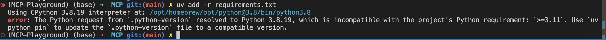

## Setup Project using UV

- uv init

### Create and setup virtual environment

- uv venv
- source .venv/bin/activate
- create requirements.txt
- uv add -r requirements.txt
- edit python version in pyproject.toml ( requires-python = ">=3.11" )

- uv python pin 3.11

